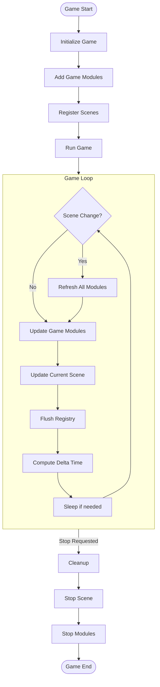

# Game

In this section we will show you how to create a game using the engine.

## Game Flowchart

This flowchart shows how the `Game` class interacts with other classes in the engine.



## Example game:

```cpp
int main()
{
    auto game = engine::Game(); // Create a game instance

    game.addModule<GameRenderingModule>(800, 800, "Example"); // Add a rendering module to the game

    const auto networkGameModule = game.addModule<NetworkGameModule>(); // Add a network module to the game

    const auto levelExample = game.registerScene<LevelExample>("game"); // Register a scene
    {
        const auto net = levelExample->addModule<ANetworkSceneModule>(*networkGameModule); // Add a network module to the scene
        levelExample->addModule<levelExample::PacketHandlerSceneModule>(net); // Add a packet handler module to the scene
        levelExample->addModule<ASceneRenderingModule>(); // Add a rendering module to the scene
    }

    game.run(); // Run the game
    return 0;
}
```
